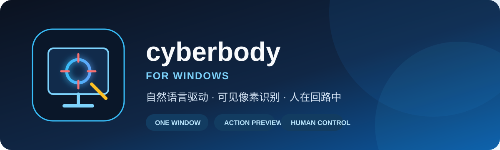
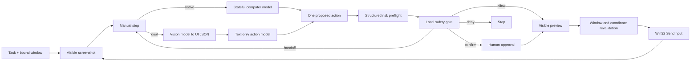

<p align="center">
  
</p>

<p align="center">
  <strong>English</strong> · <a href="README.md">简体中文</a>
</p>

<p align="center">
  
  
  
  
  
</p>

# cyberbody for Windows

cyberbody is a **human-supervised Computer Use agent for Windows**. Describe a task, explicitly bind one target window, and let the application run a controlled loop of screenshot, model planning, risk inspection, visible preview, input, and observation.

Native mode uses the formal Responses API `computer` tool: one multimodal model keeps conversation state, observes screenshots, and returns structured action batches. Dual-model compatibility mode remains available for providers where a vision model must describe the screen for a text-only planner. Both modes share the deterministic local safety gate, window boundary, preview, and Win32 `SendInput` layers.

> [!WARNING]
> cyberbody is alpha software that sends real keyboard and mouse input. Start with the bundled deterministic test window. Do not use it for payments, production administration, elevated applications, or unattended workflows. It is not a sandbox.

## Relationship to ChatGPT Computer Use

OpenAI does not publish the private ChatGPT Work interface source. cyberbody is redesigned around the documented product behavior and Computer Use API: users can watch progress, pause or take over, approve sensitive actions, and require the model to verify results after UI changes. It is not a copy of ChatGPT's UI or internal code.

The isolation boundary is materially different. ChatGPT Work can use a separate cloud computer or browser profile; this version of cyberbody controls one explicitly bound window on the current Windows desktop. Keep using the deterministic test window or a VM for risky workflows.

## Highlights

- **One-window authorization:** the task pauses when the target loses focus, moves, minimizes, closes, or changes identity.
- **Two execution engines:** use stateful native Computer Use or a decoupled vision and text-planning pair.
- **Visible action previews:** click locations and drag paths are highlighted before execution.
- **Human approval:** destructive, external, financial, permission, upload, and sensitive-data actions stop immediately before impact.
- **Auditable sessions:** raw screenshots, model-sized screenshots, annotated previews, and JSONL events are retained locally.
- **Immediate stop:** the panel, CLI, and global `Ctrl+Shift+F12` shortcut can stop the worker independently of the model.
- **DPI-safe input:** multi-monitor layouts, negative coordinates, and 100%–200% scaling are mapped to physical pixels and revalidated.

## How it works



See [docs/architecture.md](docs/architecture.md) for state, coordinate, IPC, and module details.

## Requirements

- Windows 10 22H2 or Windows 11 x64
- Python 3.12 for source development, or the self-contained portable release
- Network access and credentials for the selected execution mode
- Native mode: a Responses API model that supports the formal `computer` tool
- Dual mode: an image-capable JSON Schema model and a text-capable JSON Schema model
- A visible, non-elevated target application

Both endpoints use an OpenAI Responses-compatible `/responses` API. Model availability, compatibility, and limits depend on the configured providers.

## Quick start from source

```powershell
git clone <repository-url>
cd cyberbody
python -m venv .venv
.\.venv\Scripts\python.exe -m pip install --upgrade pip
.\.venv\Scripts\python.exe -m pip install -e ".[dev]"
```

Launch the deterministic local test window first:

```powershell
.\.venv\Scripts\cyberbody-test-window.exe
```

Then launch cyberbody:

```powershell
.\.venv\Scripts\cyberbody.exe start
```

Use the crosshair to bind the test window and try:

> Enter “小明” in the name field, drag progress to 80, tick the agreement box, scroll to the bottom, and click Next. Do not click Delete.

## Execution modes

| Mode | Model input | Best fit |
| --- | --- | --- |
| Native Computer Use (default) | User task, stateful Responses conversation, current screenshots | Multimodal models with formal `computer` tool support |
| Dual-model compatibility | Vision model sees screenshots; text planner sees structured UI JSON | Split providers and text-only action models |

Native mode preserves `previous_response_id`, executes each `computer_call.actions` batch, and returns a screenshot as `computer_call_output` with the matching `call_id`. Provider safety checks are not acknowledged until the user approves them in the workspace.

The native credential is read from `CYBERBODY_COMPUTER_API_KEY`, the endpoint-scoped `cyberbody/ComputerAPI/<URL hash>` Windows credential, or `OPENAI_API_KEY` for the default OpenAI endpoint. The default native model is `gpt-5.6-sol`.

### Dual-model compatibility

The supervisor exposes two independent endpoint profiles:

| Endpoint | Input | Output | Required capability |
| --- | --- | --- | --- |
| Vision | Bound-window screenshot | Structured text, elements, bounds, and coordinates | Image input and JSON Schema |
| Action | User task, UI JSON, and recent action history | At most one structured action per round | Text input and JSON Schema |

Leave an API URL empty to use OpenAI, or enter an HTTPS Responses-compatible endpoint. Local model servers may use loopback HTTP. Models, URLs, and non-secret settings are saved to `config.json`. Third-party credentials are scoped by role and a hash of the API URL, so changing a URL requires entering a key for the new endpoint.

Keys are read from `CYBERBODY_COMPUTER_API_KEY`, `CYBERBODY_VISION_API_KEY`, and `CYBERBODY_ACTION_API_KEY`, or endpoint-scoped Windows Credential Manager entries. OpenAI endpoints may also use `OPENAI_API_KEY` and the legacy `cyberbody/OpenAI` credential. Keys are never accepted as command-line arguments or written to configuration and session logs.

Example compatible model split:

```text
Vision URL: https://api.deepseek.com
Vision model: deepseek-v4-flash-vision-exp
Action URL: https://api.deepseek.com
Action model: deepseek-v4-flash
```

## CLI

```powershell
cyberbody.exe start
cyberbody.exe run --task "Open settings in the bound window, but do not submit anything"
cyberbody.exe status
cyberbody.exe stop
```

`run` opens the supervisor panel and pre-fills a task. Window authorization and the Start button always remain explicit human steps. The single-instance local command channel is restricted to the current Windows user and never accepts API keys.

## Safety decisions

| Decision | Behavior | Examples |
| --- | --- | --- |
| `allow` | Preview, then execute | Reversible navigation and ordinary selection |
| `confirm` | Wait immediately before impact | Delete, send, publish, upload, payment, permission, sensitive input |
| `handoff` | The user performs the step manually | Final password change and security-warning boundaries |
| `deny` | Stop and record the reason | Prompt injection, out-of-scope action, safety bypass |

The deterministic local policy may always raise the model's risk level. Rejecting a confirmation produces no corresponding input event.

## Supported boundaries

- One visible, foreground, standard-user window per task.
- Visible owned modal dialogs are allowed only when they belong to the bound process.
- Stale coordinates are discarded after the window moves or resizes.
- The agent pauses when another application gains focus.
- Administrator windows, UAC secure desktop, lock screen, DRM content, exclusive fullscreen games, and anti-cheat environments are unsupported.
- Cross-application and unattended remote operation are intentionally unsupported.

## Privacy

Native mode sends the task, screenshots, and action results to the Computer endpoint. Dual mode sends screenshots to the vision endpoint while the action endpoint receives only task text, UI JSON, and recent action history. Provider-side handling and retention depend on the services you configure. Local sessions are written to:

```text
%LOCALAPPDATA%\cyberbody\sessions\<session-id>
```

Sessions can contain sensitive pixels. They are retained for seven days by default, can be exported as an unencrypted ZIP, and rely on Windows user-directory permissions rather than application-layer encryption. cyberbody contains no project-owned telemetry or advertising analytics.

Read [docs/privacy.md](docs/privacy.md) before using personal or business data, and never attach a raw session archive to a public issue.

## Quality checks

```powershell
.\scripts\quality.ps1
```

The quality gate runs Ruff lint and formatting, mypy, Bandit, pytest with branch coverage, and a repository privacy scan for high-confidence secrets and personal paths.

## Portable build

```powershell
.\scripts\build.ps1
```

Exit every running cyberbody instance before building; Windows otherwise locks DLL/PYD files in the portable directory.

Artifacts:

```text
dist\cyberbody\cyberbody.exe
dist\cyberbody-Windows-x64.zip
dist\cyberbody-Windows-x64.zip.sha256
```

The portable directory includes Python and its runtime dependencies. Current builds are unsigned and may trigger Windows SmartScreen. See [docs/releasing.md](docs/releasing.md) for the clean-machine release checklist.

For repository settings, branch protection, naming, and demo preparation, see the [GitHub launch checklist](docs/github-launch.md).

## Project layout

```text
src/cyberbody/
├── api.py          Native Computer Use, dual-model loop, and structured preflight
├── capture.py      Visible-pixel capture and model scaling
├── controller.py   State machine, limits, and worker thread
├── input.py        Win32 SendInput and Unicode typing
├── safety.py       Deterministic local risk policy
├── storage.py      Sessions, screenshots, export, and retention
├── ui.py           PySide6 supervisor panel and overlays
└── windows.py      Window identity, DPI, ownership, and bounds
```

## Contributing and security

- Contribution guide: [CONTRIBUTING.md](CONTRIBUTING.md)
- Security policy: [SECURITY.md](SECURITY.md)
- Support guidance: [SUPPORT.md](SUPPORT.md)
- Release history: [CHANGELOG.md](CHANGELOG.md)

Please report vulnerabilities privately. Do not publish real credentials, personal screenshots, or exploit details in an issue.

## References

- [OpenAI Responses API](https://developers.openai.com/api/reference/resources/responses)
- [OpenAI Computer use](https://developers.openai.com/api/docs/guides/tools-computer-use)
- [ChatGPT browser and computer use](https://learn.chatgpt.com/docs/browser)
- [OpenAI image inputs](https://developers.openai.com/api/docs/guides/images-vision)
- [OpenAI structured outputs](https://developers.openai.com/api/docs/guides/structured-outputs)
- [DeepSeek Vision](https://api-docs.deepseek.com/guides/vision/)
- [DeepSeek Responses API](https://api-docs.deepseek.com/guides/responses_api/)
- [OpenAI Python SDK](https://github.com/openai/openai-python)

Compatibility, capabilities, pricing, and limits may change. Verify them in each configured provider's current documentation and account dashboard. Accepting a third-party endpoint does not imply endorsement or support between cyberbody and that provider.

## License

[MIT License](LICENSE) © 2026 cyberbody contributors.

cyberbody is an independent open-source project and is not affiliated with, endorsed by, or sponsored by OpenAI or Microsoft. Users are responsible for complying with applicable law, service terms, and organizational policy.
