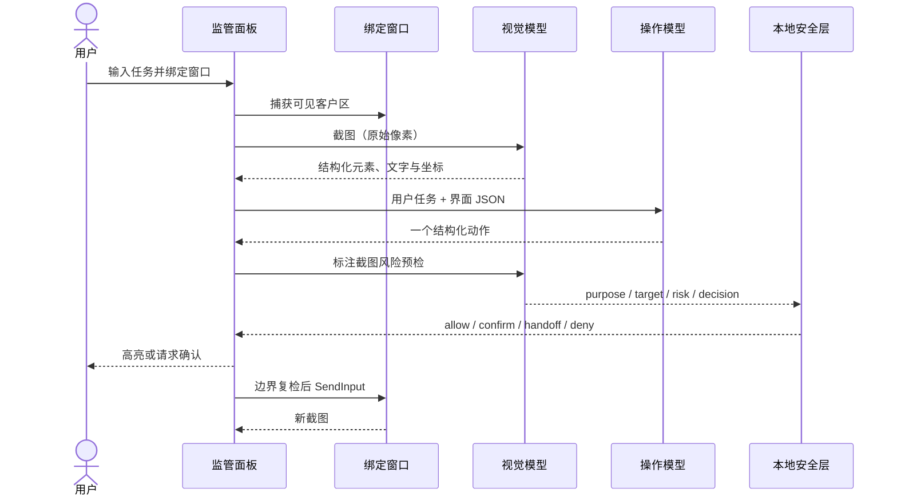

<p align="center">
  
</p>

<p align="center">
  <a href="README.en.md">English</a> · <strong>简体中文</strong>
</p>

<p align="center">
  
  
  
  
  
</p>

# cyberbody for Windows

cyberbody 是一个**人在回路中的 Windows 可视化操作智能体**。你用自然语言描述任务、明确绑定一个目标窗口；它循环执行“截图 → 视觉识别 → 文本规划 → 风险预检 → 高亮预览 → 鼠标键盘操作 → 再观察”，直到完成、停止或需要你接管。

它只依赖目标窗口的**可见像素**理解界面，不读取 UI Automation 控件树、浏览器 DOM 或应用内部数据。视觉模型把截图转换为带坐标的结构化界面描述，操作模型只读取文本 JSON 并提出下一步动作；本地安全层裁决后再由 Win32 `SendInput` 执行。因此操作模型不需要支持图片，两个模型也可以使用不同的 Responses-compatible API。

> [!WARNING]
> cyberbody 当前处于 Alpha 阶段，会向真实桌面发送输入。请先使用项目自带测试窗口，不要用于付款、生产后台、管理员工具或无人值守任务。它不是安全沙箱。

## 为什么是 cyberbody

很多桌面自动化方案依赖控件树、固定选择器或全桌面控制。cyberbody 选择了更窄但更透明的边界：

- **一次只授权一个窗口**：目标失焦、移动、最小化、关闭或被替换时暂停。
- **视觉与操作解耦**：截图只发给视觉接口，纯文本模型也可以承担操作规划。
- **动作先给人看**：点击、拖拽和输入位置先由透明覆盖层高亮，再执行。
- **高影响动作即时确认**：删除、发送、上传、付款、权限变更和敏感输入不会静默发生。
- **可审计**：每轮保存原始截图、模型截图、标注预览和动作级 JSONL 日志。
- **可随时停止**：侧边面板、命令行和全局 `Ctrl+Shift+F12` 都能触发停止。
- **坐标安全**：支持多显示器、负坐标和 100%–200% 缩放，执行前重新验证几何。

## 功能概览

| Area | Included in 0.1 |
| --- | --- |
| 任务 | 自然语言输入、单任务执行、简要状态与当前动作说明 |
| 绑定 | 下拉窗口列表、十字准星选窗、根窗口与同进程自有模态对话框 |
| 模型 | 独立视觉/操作模型、独立 API 地址与凭据、旧版单模型配置自动迁移 |
| 视觉 | 可见客户区截图、结构化元素与坐标、截图缩略图、感知哈希卡住检测 |
| 动作 | 点击、双击、移动、滚动、拖拽、按键、Unicode/中文输入、等待、截图 |
| 监管 | 约 500 ms 动作高亮、暂停/继续/停止、风险确认、人工接管 |
| 安全 | 前台/进程/几何/坐标检查、提示注入拒绝、50 动作/10 分钟默认上限 |
| 数据 | 本地会话目录、7 天清理、单会话 ZIP 导出、全部清除、日志脱敏 |
| 控制 | 单实例进程、当前用户本地管道、`start/run/status/stop` 命令 |
| 发布 | PyInstaller Windows x64 便携目录，目标电脑无需预装 Python |

## 工作方式



详细设计见 [docs/architecture.md](docs/architecture.md)。

## 快速开始

### 方式一：使用 Windows 便携包

1. 从 GitHub Releases 下载 `cyberbody-Windows-x64.zip` 和对应 `.sha256`。
2. 校验哈希并解压到普通用户可写目录。
3. 运行 `cyberbody\cyberbody.exe`。
4. 配置视觉接口和操作接口，启动项目自带测试窗口，绑定后执行示例任务。

当前构建没有商业代码签名，首次启动时 Windows SmartScreen 可能显示“未知发布者”。请只从项目的 GitHub Release 获取文件并核对 SHA-256。

### 方式二：从源码运行

要求：Windows 10 22H2/Windows 11 x64、Python 3.12 和联网环境。视觉模型必须支持图片输入和 JSON Schema；操作模型只需支持文本输入和 JSON Schema。两端均使用 OpenAI Responses-compatible `/responses` 接口。

```powershell
git clone <repository-url>
cd cyberbody
python -m venv .venv
.\.venv\Scripts\python.exe -m pip install --upgrade pip
.\.venv\Scripts\python.exe -m pip install -e ".[dev]"
```

先启动完全本地、不会接触真实数据的测试窗口：

```powershell
.\.venv\Scripts\cyberbody-test-window.exe
```

再启动 cyberbody：

```powershell
.\.venv\Scripts\cyberbody.exe start
```

用十字准星绑定“cyberbody 自动化验收窗口”，输入：

> 在姓名中输入“小明”，把进度拖到 80，勾选同意，滚动到底部并点击“下一步”；不要点击删除。

## 双模型接口

面板提供两套相互独立的配置：

| 接口 | 输入 | 输出 | 能力要求 |
| --- | --- | --- | --- |
| 视觉模型 | 目标窗口截图 | 可操作元素、文字、状态、边界和坐标 JSON | 必须支持图片与 JSON Schema |
| 操作模型 | 用户任务、界面 JSON、最近动作历史 | 每轮最多一个结构化动作 | 只需文本与 JSON Schema |

API 地址留空时使用 OpenAI；也可填写兼容 Responses API 的 HTTPS 地址。本机模型服务可使用 `http://localhost` 或 `http://127.0.0.1`。视觉和操作接口可以来自不同服务商；第三方凭据按“角色 + API 地址摘要”隔离，修改地址后必须为新地址重新录入密钥。

例如使用 DeepSeek 时，视觉接口应选择支持图片的模型，操作接口可以选择纯文本模型：

```text
视觉 API：https://api.deepseek.com
视觉模型：deepseek-v4-flash-vision-exp
操作 API：https://api.deepseek.com
操作模型：deepseek-v4-flash
```

模型和 API 地址保存在 `%LOCALAPPDATA%\cyberbody\config.json`；密钥只从以下位置读取：

1. `CYBERBODY_VISION_API_KEY` / `CYBERBODY_ACTION_API_KEY`；
2. OpenAI 默认地址还可回退到 `OPENAI_API_KEY`；
3. 面板写入的 Windows Credential Manager 条目 `cyberbody/VisionAPI/<地址摘要>` 和 `cyberbody/ActionAPI/<地址摘要>`；
4. 旧版 OpenAI 配置可回退读取 `cyberbody/OpenAI`，但只用于 OpenAI 默认地址。

```powershell
$env:CYBERBODY_VISION_API_KEY = "<vision-api-key>"
$env:CYBERBODY_ACTION_API_KEY = "<action-api-key>"
.\.venv\Scripts\cyberbody.exe start
```

不要把真实密钥写进 `.env.example`、Issue、截图或仓库历史。第三方接口的兼容程度不同，正式使用前必须在项目测试窗口验证图片输入和 JSON Schema。

## 命令行

便携包和开发安装都支持相同命令：

```powershell
cyberbody.exe start
cyberbody.exe run --task "在绑定窗口中打开设置，但不要提交任何内容"
cyberbody.exe status
cyberbody.exe stop
```

- 无参数启动等同于 `start`。
- `run` 只打开面板并预填任务；仍需用户明确绑定窗口并点击开始。
- `status` 返回当前状态、目标、任务和会话 ID。
- `stop` 先停止动作、释放输入状态，再正常关闭现有进程。

本地控制通道只允许当前 Windows 用户访问，不接收 API 密钥。

## 安全决策

| Decision | Behavior | Typical examples |
| --- | --- | --- |
| `allow` | 高亮后自动执行 | 普通导航、展开面板、选择非敏感选项 |
| `confirm` | 动作发生前等待用户允许 | 删除、发送、发布、上传、付款、权限、系统设置、敏感文本 |
| `handoff` | 用户亲自完成，然后选择继续观察 | 修改密码最终步骤、安全警告、付费墙相关步骤 |
| `deny` | 停止任务并记录原因 | 提示注入、越权窗口、绕过安全限制、超出任务范围 |

无论模型怎样建议，本地安全规则都可以把风险升级。拒绝确认后不会产生对应输入事件。

## 窗口与输入边界

- 只支持普通权限、可见、非最小化的顶层窗口。
- 允许目标窗口同进程拥有的可见模态对话框；其他进程弹窗会导致暂停。
- 目标窗口必须处于前台。失焦后不会向新前台窗口发送输入。
- 截图后若窗口移动或缩放，旧坐标被丢弃；继续后必须重新截图规划。
- 不支持管理员窗口、UAC 安全桌面、锁屏、DRM 画面、独占全屏游戏和反作弊环境。
- 不执行跨应用任务，也不支持无人值守巡检。

## 隐私与本地数据

目标窗口截图和任务相关提示会发送到视觉接口；操作接口只接收用户任务、视觉模型生成的文本 JSON 和最近动作历史，不接收截图。两端的数据处理与保留取决于你配置的服务商及账户设置。cyberbody 自身不包含遥测或广告分析。

本地路径：

```text
%LOCALAPPDATA%\cyberbody\config.json
%LOCALAPPDATA%\cyberbody\sessions\<session-id>\
```

每个会话可能包含敏感截图。默认保留 7 天，启动时和每 24 小时清理；面板可导出当前会话或清除全部会话。文件依赖 Windows 用户目录权限，没有额外加密，导出的 ZIP 也不加密。

发布或提交 Issue 前请阅读 [docs/privacy.md](docs/privacy.md)，不要上传原始会话包。

## 开发与质量检查

```powershell
.\scripts\quality.ps1
```

该命令依次运行：

- Ruff lint 和格式检查；
- mypy 类型检查；
- Bandit Python 安全扫描；
- pytest、分支覆盖率；
- 高置信度密钥与个人路径隐私扫描。

也可以单独运行测试：

```powershell
.\.venv\Scripts\python.exe -m pytest --cov=cyberbody --cov-report=term-missing
```

单元测试和模拟 API 不会操作真实桌面。在线端到端测试应只绑定项目测试窗口或隔离虚拟机。

## 构建 Windows x64 便携包

```powershell
.\scripts\build.ps1
```

构建前必须先退出正在运行的 cyberbody，否则 Windows 会锁定便携目录中的 DLL/PYD 文件。

输出：

```text
dist\cyberbody\cyberbody.exe
dist\cyberbody-Windows-x64.zip
dist\cyberbody-Windows-x64.zip.sha256
```

构建脚本会先执行全部质量门禁。完整发布流程见 [docs/releasing.md](docs/releasing.md)。

首次创建公开仓库、配置分支保护和准备演示素材时，请使用 [GitHub 发布清单](docs/github-launch.md)。

## 项目结构

```text
cyberbody/
├── .github/                 # CI、CodeQL、Release、Issue/PR 模板
├── docs/                    # 架构、隐私和发布说明
├── scripts/                 # 质量、隐私扫描和构建脚本
├── src/cyberbody/
│   ├── api.py               # 双模型识别/规划循环与结构化预检
│   ├── capture.py           # 可见像素截图与模型缩放
│   ├── controller.py        # 状态机、限制和工作线程
│   ├── input.py             # Win32 SendInput
│   ├── safety.py            # 确定性风险裁决
│   ├── storage.py           # 会话、截图、导出和清理
│   ├── ui.py                # PySide6 监管面板与覆盖层
│   └── windows.py           # 窗口、DPI、进程和边界验证
├── tests/                   # 无真实输入的确定性测试
├── cyberbody.spec         # PyInstaller x64 配置
└── pyproject.toml           # 包、工具和依赖配置
```

## 常见问题

<details>
<summary><strong>为什么不能绑定管理员窗口？</strong></summary>

普通权限进程受 Windows UIPI 限制，不能可靠地向高完整性窗口发送输入。0.1 版把管理员窗口列为不支持范围，也不会操作 UAC 安全桌面。请用普通权限启动目标应用。
</details>

<details>
<summary><strong>为什么窗口失焦后任务暂停？</strong></summary>

这是防止输入落入聊天窗口、终端或其他应用的核心边界。把目标窗口恢复到前台后，在面板点击继续；程序会重新截图，不会复用旧坐标。
</details>

<details>
<summary><strong>为什么 API 暂时失败后没有重放刚才的点击？</strong></summary>

网络请求可以重试，但已经产生外部效果的动作不能盲目重放。cyberbody 会重新观察界面，让模型基于当前画面继续。
</details>

<details>
<summary><strong>能否在 Linux/macOS 或远程服务器使用？</strong></summary>

不能。当前实现依赖 Win32 窗口、DPI、命名互斥体和 `SendInput`，只支持 Windows x64 普通用户桌面。
</details>

## Roadmap

- [ ] 隔离虚拟机执行后端
- [ ] 可配置的组织安全策略与审批记录
- [ ] 更完整的无障碍键盘导航和界面国际化
- [ ] 录制式确定性回放测试与视觉回归基线
- [ ] 代码签名和可验证的 Release provenance
- [ ] 在明确授权下设计并测试独立管理员模式

Roadmap 不是交付承诺。欢迎在 Feature Request 中讨论用例和安全边界。

## 参与贡献

请阅读 [CONTRIBUTING.md](CONTRIBUTING.md)。Bug、文档、测试、DPI/多屏复现和安全策略改进都很有价值。

- 一般问题与建议：GitHub Issues/Discussions
- 使用帮助：[SUPPORT.md](SUPPORT.md)
- 安全漏洞：请勿公开提交，遵循 [SECURITY.md](SECURITY.md)
- 版本变化：[CHANGELOG.md](CHANGELOG.md)

## 接口参考

- [OpenAI Responses API](https://developers.openai.com/api/reference/resources/responses)
- [OpenAI image inputs](https://developers.openai.com/api/docs/guides/images-vision)
- [OpenAI structured outputs](https://developers.openai.com/api/docs/guides/structured-outputs)
- [DeepSeek Vision](https://api-docs.deepseek.com/guides/vision/)
- [DeepSeek Responses API](https://api-docs.deepseek.com/guides/responses_api/)
- [OpenAI Python SDK](https://github.com/openai/openai-python)

兼容性、模型能力、限额和费用可能变化，请以所选服务商的当前文档和账户控制台为准。配置第三方 API 地址不代表 cyberbody 或该服务商对彼此提供认可或支持。

## License

[MIT License](LICENSE) © 2026 cyberbody contributors.

cyberbody 是独立开源项目，与 OpenAI 或 Microsoft 无附属、认可或赞助关系。使用者负责确保自动化行为符合适用法律、服务条款和组织政策。
