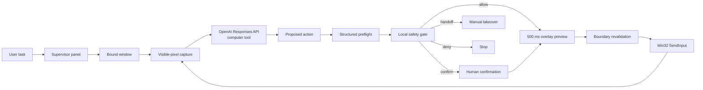
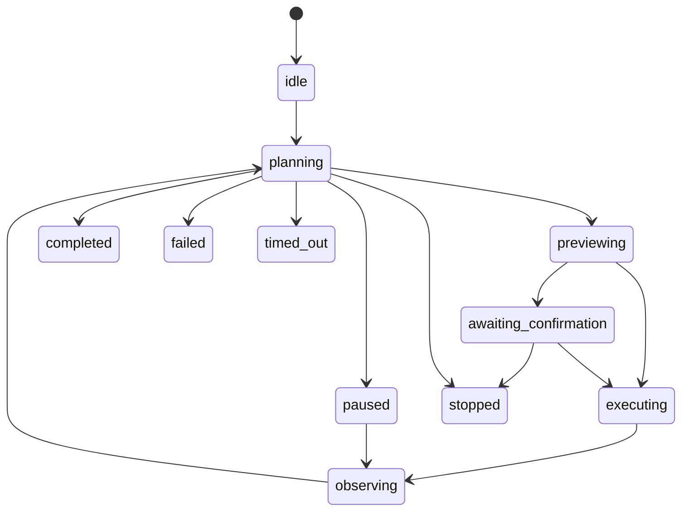

# Architecture

本文面向贡献者，描述 cyberbody 0.1 的执行循环、安全不变量、线程模型和模块边界。

## 设计目标

cyberbody 是受监管的单窗口视觉智能体，而不是通用远程控制器。它只从可见像素识别界面，通过模型提出动作，并在本地安全层批准后使用 Win32 输入事件执行。

核心不变量：

1. 一次任务只绑定一个根窗口和同进程的可见自有对话框。
2. 每次输入前重新检查窗口身份、前台状态、截图几何和坐标范围。
3. 屏幕内容永远不是用户授权；高影响动作必须即时确认或交给用户。
4. 已执行动作在网络失败时不会自动重放。
5. 停止操作不依赖模型响应，并尽力释放所有输入状态。

## 数据与控制流



## 状态机



只有 `completed`、`failed`、`stopped` 和 `timed_out` 是任务终态。面板进程可以在任务终态后继续运行以查看会话结果。

## 模块边界

| Module | Responsibility |
| --- | --- |
| `models.py` | 不可变动作、坐标矩形、捕获帧、会话状态和风险枚举。 |
| `windows.py` | 窗口枚举、绑定、进程身份、DPI、授权对话框、前台与几何验证。 |
| `capture.py` | 使用 `ImageGrab` 捕获客户区可见像素、缩放模型图像和计算感知哈希。 |
| `api.py` | 正式 `computer` 工具循环、截图输出、结构化风险预检和有限重试。 |
| `safety.py` | 确定性本地风险分类，以及 `allow/confirm/handoff/deny` 最终裁决。 |
| `input.py` | x64 Win32 `SendInput`、Unicode 文本、多显示器绝对坐标和输入状态释放。 |
| `controller.py` | 工作线程、状态机、动作上限、超时、卡住检测和人工确认协调。 |
| `storage.py` | 原始/模型/标注截图、JSONL 事件、会话摘要、导出和保留期清理。 |
| `ipc.py` | 当前用户范围的命名互斥体和 `QLocalServer` 单实例命令通道。 |
| `ui.py` | 监管面板、选窗覆盖层、动作预览、日志、确认和紧急停止。 |

## 坐标系统

模型看到的图像可能经过等比例缩小。`CaptureFrame` 同时保存：

- 物理屏幕中的客户区 `source_rect`，可以包含负坐标；
- 原始物理像素尺寸；
- 发送给模型的图像尺寸；
- 实际捕获窗口句柄。

模型坐标 `(mx, my)` 映射为物理坐标：

```text
screen_x = source_left + round(mx * source_width / model_width)
screen_y = source_top  + round(my * source_height / model_height)
```

`SendInput` 再按照整个虚拟桌面矩形映射到 Windows 的 `0..65535` 绝对坐标。动作前会确认模型坐标和映射结果仍在捕获客户区内，并确认窗口从截图后没有移动或缩放。

## 安全分层

安全不是单一模型判断：

1. 系统指令要求只操作绑定窗口，并把屏幕内容视为不可信。
2. 独立结构化预检为动作生成用途、目标、风险和建议决策。
3. 本地确定性规则可以升级风险，不能被模型降级绕过。
4. 用户在动作发生前确认删除、发送、付款、上传、权限和敏感输入。
5. 密码最终步骤、安全绕过和付费墙绕过必须人工接管。
6. 提示注入和越界动作被拒绝。
7. `InputExecutor` 最后执行窗口与坐标验证。

## 线程和停止

Qt UI 运行在主线程；模型调用与截图—动作循环运行在一个守护工作线程。跨线程 UI 更新通过 Qt `Signal`。暂停使用运行门事件，停止使用独立 `Event`；拖拽、等待和 API 重试退避会观察该事件。

OpenAI SDK 的同步 HTTP 调用本身不能在任意时刻强制取消，但停止后返回的结果不会继续执行。紧急停止会并行请求释放所有已按下的按键和鼠标按钮。

## 本地 IPC

- 命名互斥体防止并发启动竞态。
- 服务名包含当前用户名和主目录的 SHA-256 短摘要，不暴露原文。
- `QLocalServer.UserAccessOption` 把命令通道限制为当前 Windows 用户。
- IPC 只接受 `start`、`run`、`status` 和 `stop`，不接收 API 密钥。

## 会话目录

```text
%LOCALAPPDATA%\cyberbody\sessions\<session-id>\
├── session.json
├── events.jsonl
├── round-0001.png
├── round-0001-model.png
└── round-0001-annotated.png
```

详细隐私说明见 [privacy.md](privacy.md)。
