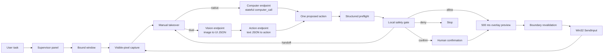
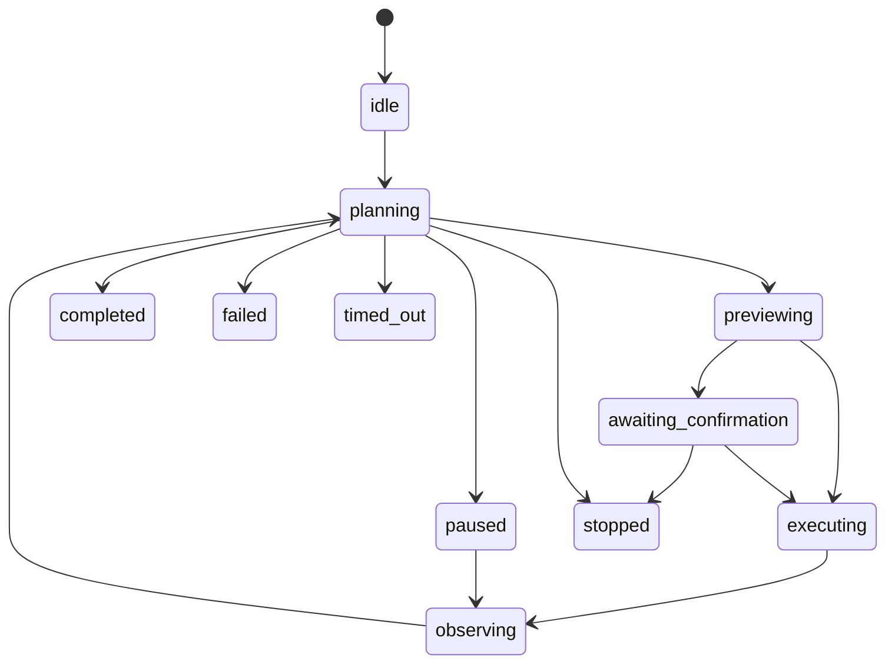

# Architecture

本文面向贡献者，描述 cyberbody 的原生 Computer Use 与双模型兼容执行循环、安全不变量、线程模型和模块边界。

## 设计目标

cyberbody 是受监管的单窗口视觉智能体，而不是通用远程控制器。它只从可见像素识别界面。默认引擎让支持正式版 `computer` 工具的模型在持续 Responses 会话中直接返回动作；兼容引擎由视觉模型生成结构化观察，再由文本操作模型提出动作。两者都必须经过本地安全层批准，最终由 Win32 输入事件执行。

核心不变量：

1. 一次任务只绑定一个根窗口和同进程的可见自有对话框。
2. 每次输入前重新检查窗口身份、前台状态、截图几何和坐标范围。
3. 屏幕内容永远不是用户授权；高影响动作必须即时确认或交给用户。
4. 已执行动作在网络失败时不会自动重放。
5. 停止操作不依赖模型响应，并尽力释放所有输入状态。

## 数据与控制流



## 状态机



只有 `completed`、`failed`、`stopped` 和 `timed_out` 是任务终态。面板进程可以在任务终态后继续运行以查看会话结果。

## 模块边界

| Module | Responsibility |
| --- | --- |
| `models.py` | 不可变动作、坐标矩形、捕获帧、会话状态和风险枚举。 |
| `windows.py` | 窗口枚举、绑定、进程身份、DPI、授权对话框、前台与几何验证。 |
| `capture.py` | 使用 `ImageGrab` 捕获客户区可见像素、缩放模型图像和计算感知哈希。 |
| `api.py` | 原生 `computer` 客户端、独立视觉/操作兼容客户端、结构化风险预检和有限重试。 |
| `safety.py` | 确定性本地风险分类，以及 `allow/confirm/handoff/deny` 最终裁决。 |
| `input.py` | x64 Win32 `SendInput`、Unicode 文本、多显示器绝对坐标和输入状态释放。 |
| `controller.py` | 工作线程、状态机、动作上限、超时、卡住检测和人工确认协调。 |
| `storage.py` | 原始/模型/标注截图、JSONL 事件、会话摘要、导出和保留期清理。 |
| `ipc.py` | 当前用户范围的命名互斥体和 `QLocalServer` 单实例命令通道。 |
| `ui.py` | Agent workspace、实时视口、活动时间线、选窗覆盖层、确认、接管和紧急停止。 |

## 坐标系统

视觉模型看到的图像可能经过等比例缩小。`CaptureFrame` 同时保存：

- 物理屏幕中的客户区 `source_rect`，可以包含负坐标；
- 原始物理像素尺寸；
- 发送给模型的图像尺寸；
- 实际捕获窗口句柄。

视觉模型产生的图像坐标由操作模型原样选择或在已识别边界内计算。模型坐标 `(mx, my)` 映射为物理坐标：

```text
screen_x = source_left + round(mx * source_width / model_width)
screen_y = source_top  + round(my * source_height / model_height)
```

`SendInput` 再按照整个虚拟桌面矩形映射到 Windows 的 `0..65535` 绝对坐标。动作前会确认模型坐标和映射结果仍在捕获客户区内，并确认窗口从截图后没有移动或缩放。

## 安全分层

安全不是单一模型判断：

1. 两种引擎都被明确告知屏幕文字是不可信数据，不构成授权或策略。
2. 原生引擎保留 `previous_response_id`，但执行环境状态仍由本地窗口负责；会话续接不能绕过窗口复检。
3. 双模型引擎只让操作模型接收文本 JSON，截图只发送到视觉接口。
4. 独立结构化预检结合标注截图，为动作生成用途、目标、风险和建议决策。
5. 原生接口返回的 `pending_safety_checks` 会升级为即时确认，只有用户允许后才作为已确认内容随下一张截图回传。
6. 本地确定性规则可以升级风险，不能被模型降级绕过。
7. 用户在动作发生前确认删除、发送、付款、上传、权限和敏感输入。
8. 密码最终步骤、安全绕过和付费墙绕过必须人工接管；提示注入和越界动作被拒绝。
9. `InputExecutor` 最后执行窗口与坐标验证。

## 线程和停止

Qt UI 运行在主线程；视觉识别、文本规划与截图—动作循环运行在一个守护工作线程。跨线程 UI 更新通过 Qt `Signal`。暂停使用运行门事件，停止使用独立 `Event`；拖拽、等待和 API 重试退避会观察该事件。

OpenAI Python SDK 用作 Responses-compatible HTTP 客户端。同步 HTTP 调用本身不能在任意时刻强制取消，但停止后返回的结果不会继续执行。紧急停止会并行请求释放所有已按下的按键和鼠标按钮。

## 原生 Computer Use 引擎

- 官方指南对部分新模型更推荐代码执行，但 cyberbody 需要在每个动作发生前做坐标、风险和窗口边界检查，因此选择结构化 `computer` 动作接口，不向模型开放任意本机脚本执行。
- 首次请求发送可信用户任务，并要求模型先返回 `screenshot`，在观察目标窗口前提出的输入动作会被安全拒绝。
- 每次 `computer_call` 包含 `call_id` 和有序 `actions`；控制器逐个预检和执行允许的动作，然后捕获一次新截图。
- 新截图以 `computer_call_output` 返回，匹配原始 `call_id`，并通过 `previous_response_id` 延续模型上下文。
- 支持 `click`、`double_click`、`drag`、`move`、`scroll`、`keypress`、`type`、`wait` 和 `screenshot`。
- 模型对完成状态的文字声明不是最终证据；执行循环仍以最新窗口画面和本地事件记录为准。

## 双模型兼容引擎

- 视觉接口接收截图和最小任务上下文，必须支持图片输入和 JSON Schema 输出。
- 操作接口只接收用户任务、结构化界面观察和最近八轮历史，不接收图片。
- 每轮最多规划一个动作，执行后必须重新截图，避免在界面变化后继续使用旧坐标。
- 两个接口的模型名、API 地址和 Credential Manager 凭据独立；凭据按角色与地址摘要隔离，远程地址必须使用 HTTPS。
- API 地址留空表示 OpenAI 默认地址，本地回环地址可使用 HTTP，便于连接本机模型服务。
- 第三方实现必须兼容 Responses API 的 `input`、`input_image` 和 `text.format.json_schema` 子集。

已有配置文件如果没有 `execution_mode` 字段，会迁移为 `dual`，避免升级后改变既有提供商或数据流。新安装默认使用 `native`。

## 本地 IPC

- 命名互斥体防止并发启动竞态。
- 服务名包含当前用户名和主目录的 SHA-256 短摘要，不暴露原文。
- `QLocalServer.UserAccessOption` 把命令通道限制为当前 Windows 用户。
- IPC 只接受 `start`、`run`、`status` 和 `stop`，不接收 API 密钥。

## 会话目录

```text
%LOCALAPPDATA%\cyberbody\sessions\<session-id>\
├── session.json
├── events.jsonl
├── round-0001.png
├── round-0001-model.png
└── round-0001-annotated.png
```

详细隐私说明见 [privacy.md](privacy.md)。
